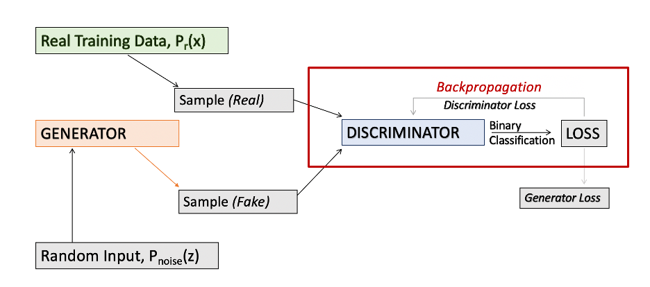
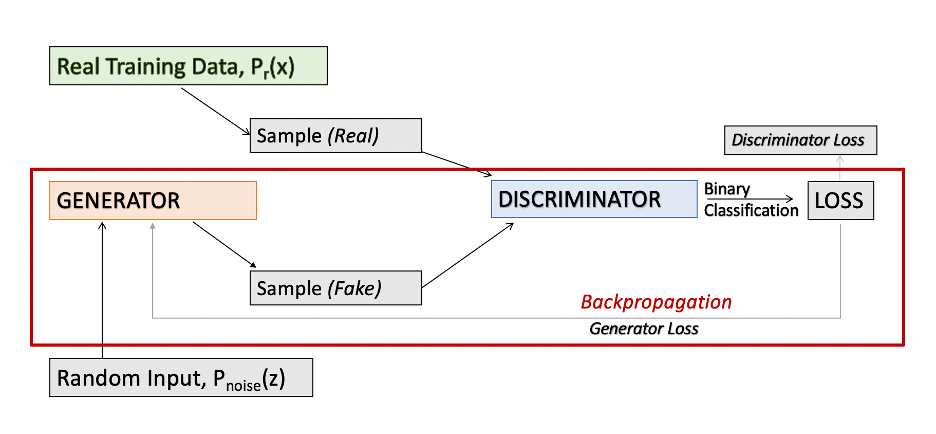
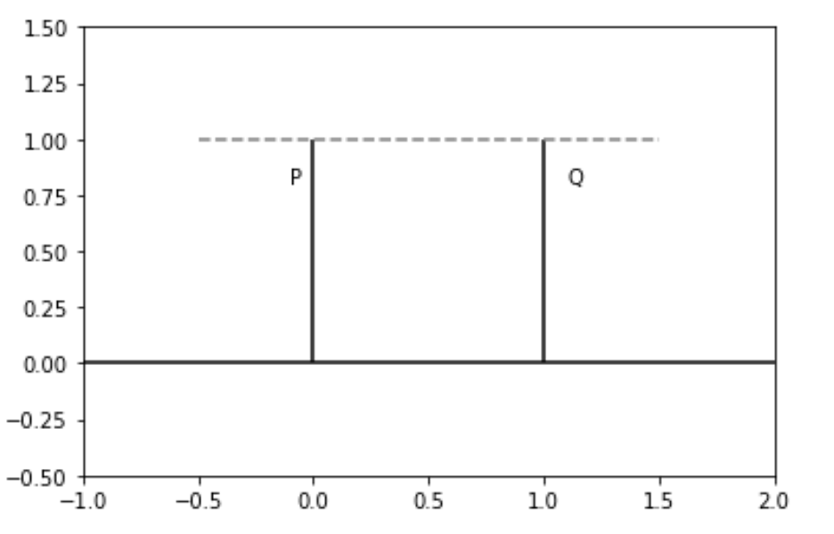
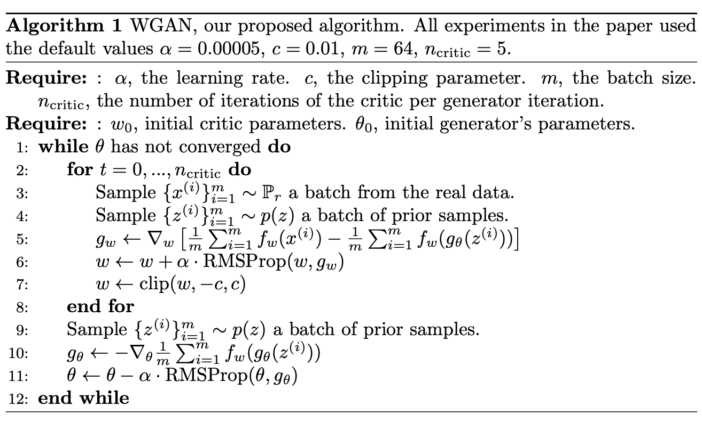
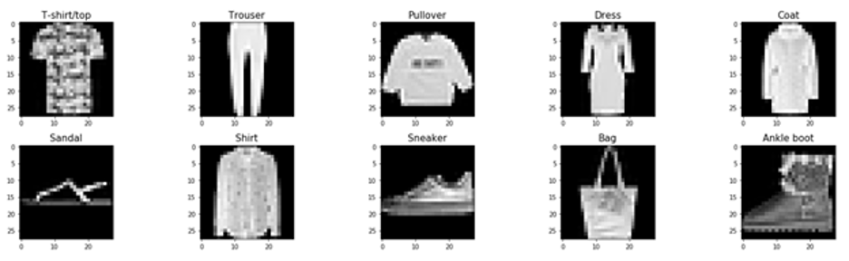
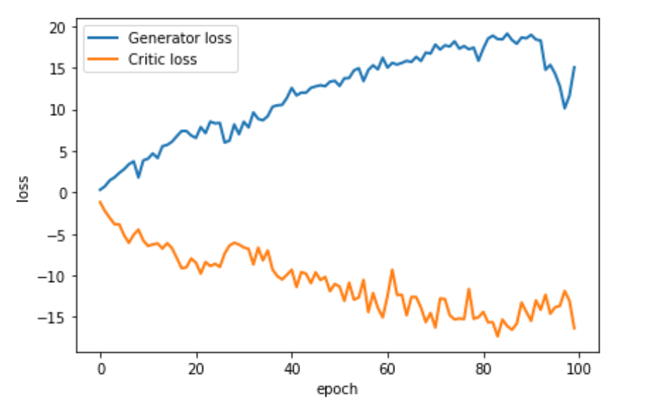

## Wasserstein Generative Adversarial Network (WGAN) Implementation

#### Author: Andrea Yoss: [LinkedIn](https://www.linkedin.com/in/andreayoss/)

*NOTE: IN PROGRESS*

---

## Introduction

Generative Adversarial Models (GANs) are powerful deep learning, generative models that were introduced by Goodfellow et al. in 2014 [1].  Through an adversarial training process between two neural networks with differing objectives, the network learns to generate data increasingly similar to that of the actual training data. The Wasserstein-GAN (WGAN) was proposed in 2017 by Arjovsky et al. to improve on this architecture.  By performing gradient descent on an approximation of the continuous and differentiable Earth-Mover (EM) distance through weight clipping, the WGAN is able to address some of the problems when training traditional GANs [2]. Common issues with traditional GANs include mode collapse and vanishing gradients.

Using the Fashion-MNIST dataset, I have implemented a WGAN model using PyTorch and JAX.
---

## Contents
- [Discriminative vs. Generative Models](#Discriminative-vs.-Generative-Models)

## Discriminative vs. Generative Models

A Discriminative model models the decision boundary between the classes. A Generative Model explicitly models the actual distribution of each class. While both models predict the conditional probability, they learn different probabilities in order to do so. A Discriminative model directly learns the conditional probability distribution; on the other hand, a Generative Model learns the joint probability distribution p(x,y), and then ultimately predicting the conditional probability using Bayes Rule.

Generative models can create new instances of data from a dataset, while discriminative models actually “discriminate” between classes in a dataset.  An example of how these models compare: While a discriminator will be able to learn to tell the difference between the number 7 and the number 9 in the classic MNIST dataset, a generative model will learn the attributes associated with the numbers.  

## Generative Adversarial Networks (GANs)

A Generative Adversarial Network (GAN) is a type of generative model proposed by Goodfellow et al. in 2014 [1].  By simultaneously training both a generative model - the generator - and a discriminative model - the discriminator, Goodfellow et al. was able to improve on the performance of prior deep learning generative models by essentially turning the unsupervised learning model into a supervised one.

Both models have different objectives in the training process: the generator seeks to copy the actual underlying distribution of the data, while the discriminator seeks to differentiate between the "real" and generated "fake" data.  This “adversarial” process can be viewed as a 2-player minimax, zero-sum game in which the players are pitted against one another. While the discriminator seeks to differentiate between "real" and "fake" data, the generator seeks to generate data similar enough to the actual data in order to "trick" the discriminator into incorrectly labeling the generated data.  

### Adversarial Training Process

The adversarial process for a GAN can also be thought of as a minimax game between the discriminator and the generator. During training, the discriminator $D(x;\theta_d)$ is trained to maximize the probability of correctly classifying the data, while the generator $G(z;\theta_g)$ is simultaneously trained to minimize $log(1-D(G(z)))$\cite{a}. This is represented by the value function $V(G,D)$:

$\min_{G}\max_{D}V(D,G) = E_{x\sim{p_{data}(x)}}[logD(x)]+E_{z\sim{p_z}(z)}[log(1-D(G(z)))],$

where $D(x)$ represents the probability that $x$ came from the real training distribution $P_{data}$ as opposed to the generator’s distribution $P_g$, $P_z$ ($P_{noise}$) is the prior on the input noise variables $z$, and $G(z)$ represents the mapping to data space.  A Nash equilibrium\footnote{In game theory, a Nash Equilibrium is achieved when no player is better off from changing his or her strategy.} is achieved in this zero-sum game when the generator gets so good that the discriminator can no longer differentiate between the generated data and the real data.  At this point, the probability of the discriminator classifying data as "real" or "fake" are both equal to $\frac{1}{2}$. This is essentially the same as random guessing.  

## Backpropagation
Both networks are modeled as neural networks\footnote{In their original paper (2014), Goodfellow et al. used a multilayer perceptron (MLP) architecture to represent the discriminator and generator models in a GAN. However, in 2016, Radford et al. proposed using convolutional neural networks (CNNs) instead of MLPs in a GAN; they called this variation on Goodfellow’s proposed architecture a deep convolutional generative adversarial neural network (DCGAN).  DCGANs have been proven to work better than traditional GANs at capturing the data distributions of image datasets such as the MNIST dataset\cite{e}.}. During the training process, parameter weights are updated in both networks through backpropagation.

Backpropagation, or the “backward propagation of errors,” is an iterative algorithm for reducing a network’s loss by updating its weight parameters based on the contribution of each parameter on that loss. The process works via gradient descent - by computing the gradient of the loss function with respect to each weight, and then backward propagating the errors through the network [4].  

In a GAN, parameter weight updates are performed iteratively.  While both the generator loss and discriminator loss are calculated by the discriminator and backward propagated through their respective networks, backpropagation only occurs in one network at a time, while the other network’s weights are fixed.  

The backpropagation process for the discriminator is summarized in the following figure.

**Figure 2** Backpropagation process for discriminator. (Image by author)

 In this stage of the learning process, only the discriminator loss is sent back through the discriminator to obtain its gradients; the generator is not involved in this process. In contrast, when updating the generator, the generator loss is actually backpropagated through both the discriminator and generator to obtain gradients. The process of training the generator over a single iteration is summarized in Figure 3.

 **Figure 3** Backpropagation process for generator. (Image by author)
 

While backpropagation is a widely applied method of parameter tuning, its success in generative networks is very much dependent on the model’s loss function, and the similarity metrics at its core.

## Similarity Metrics
To illustrate the drawbacks of using loss functions with certain similarity metrics when learning distributions supported by low dimensional manifolds, Arjovsky et al. (2017) looked at the simple case of learning two probability distributions parallel to one another in $R^2$. This scenario is shown in Figure 4.

**Figure 4** Visualization of example described in Arjovsky et al. (2017) showing how various similarity metrics behave when provided non-overlapping distributions in low dimensional manifolds. This introduced the appeal of the EM distance compared to the Kullback-Leiber (KL) Divergence and Jensen-Shannon (JS) Divergence due to the continuity exhibited by its resulting loss function. As Q moves T distance approaching the distribution P at 0, Q converges to P under the EM distance. It does not converge under the KL or JS divergences. (Image by author)

When provided two non-overlapping distributions P and Q in low dimensional manifolds, only the EM distance converges to P as Q approached the P distribution at 0; metrics such as the Kullback-Leiber (KL) Divergence and Jensen-Shannon (JS) Divergence behave poorly in this situation.

### Earth Mover Distance

The Earth Mover (EM) Distance\footnote{The EM Distance is also known as the Wasserstein-1 or Wassersein Distance.} is essentially an optimization problem where the optimal value is the infimum\footnote{The infimum (inf) is the greatest lower bound.} of the products of the joint distributions ($\gamma{\in}\prod(P_r, P_g)$) and the euclidean distance\footnote{The euclidean distance is the shortest distance between two points.  This is also referred to as the L2 or euclidean norm.} between x and y ($||x-y||$).

The EM distance formula is

$$W(P_r, P_g) = \inf_{\gamma{\in}\prod(P_r,P_g)}\mathbb{E}_{(x,y)\sim\gamma}[||x-y||],$$

where $\prod(P_r, P_g)$ is the set of all joint distributions $\gamma(x,y)$ with marginal probabilities of $P_r$ and $P_g$, respectively.

Like the KL and JS divergences, the EM distance measures the similarity between two distinct probability distributions. However, it measures this distance horizontally, as opposed to vertically, which is why it is able to perform well on non-overlapping distributions in low dimensional manifolds.

In the example illustrated in Figure 4, the EM distance will always be equal to T, as it is measured by the horizontal distance between distributions.

### Additional Similarity Metrics
The Kullback-Leiber (KL) divergence between two distributions $P_r$ and $P_g$ is
$$KL(P_r||P_g) = \int{log}(\frac{P_r(x)}{P_g(x)})P_r(x)d\mu(x).$$

In this example, the KL divergence is $\int{log}(\frac{P}{Q})Pd\mu(x)$\\
$\approx {log}(\frac{0}{1})0 = 0$ when T=0, and\\
$\approx {log}(\frac{1}{0})1 \approx{\infty}$ when T=1.

Next, the Jensen-Shannon (JS) Divergence between two distributions $P_r$ and $P_g$ is

$$JS(P_r, P_g) = KL(P_r||P_m)+KL(P_g||P_m),$$

where $P_m$ is the mixture $\frac{P_r+P_g}{2}$.

In this example, the JS divergence is $0$ when T = 1, and is the constant $log2$ when T = 0.

While the JS divergence is symmetrical and always defined, this example proves it is not continuous, and therefore, does not always provide a usable gradient.

This result is significant, as it highlights an issue with training traditional GANs which incorporates an approximation of the JS divergence in its loss function.  

Other issues a GAN model may encounter are mode collapse and the vanishing gradient problem.  Mode collapse is when the generator's output becomes less diverse. The vanishing gradient problem arises when the discriminator is so good that its gradient essentially "vanishes" preventing the generator from additional learning.

## Wasserstein Generative Adversarial Networks

In 2017, Arjovsky et al. proposed a variation on the standard GAN they referred to as the Wasserstein Generative Adversarial Network (WGAN) to address the issues encountered when training a traditional GAN [2].
While similar to traditional GANs, there are important distinctions between the WGAN algorithm and that of a traditional GAN. First, instead of minimizing an approximation of the Jensen-Shannon (JS) Divergence, WGAN minimizes an approximation of the Earth Mover (EM) Distance.

Since the EM distance is intractable, Arjovsky et al. introduced a more manageable approximation of the EM distance using the Kantorovich-Rubinstein duality,

$$W(P_r, P_g) = \sup_{||f||_L\leq{1}}\mathbb{E}_{x\sim{P_r}}[f(x)]-\mathbb{E}_{x\sim{P_\theta}}[f(x)],$$

where the supremum\footnote{The supremum(sup) is the least upper bound.} is taken over all 1-Lipschitz functions.

Instead of having a discriminator network perform binary classification, WGANs use a network that resembles more of a "critic" as it serves as a helper for estimating the EM distance between the  distributions,$P_r$ and $P_g$, by seeking to learn a K-Lipschitz continuous function.  

To enforce the Lipschitz continuity constraint during the entirety of the training process, Arjovsky et al. proposed a method called weight clipping\cite{b}.  Weight clipping is the process of clamping the weights of a neural network after each gradient update to ensure the parameters lie within a compact space, [-c, c], where c is the fixed clipping parameter.

The WGAN algorithm is summarized in Figure 5.

**Figure 5** Wasserstein Generative Adversarial Network (WGAN) algorithm [2]

As opposed to a momentum-based optimizer like Adam, RMSProp is used in the WGAN algorithm. Arjovsky et al. (2017) attribute the issues they encountered when training with momentum-based optimizers to the WGAN having a nonstationary loss function [2].

The critic will train n_critic times for every one iteration the generator trains.  In my implementation of the WGAN model, I used the default parameter value of 5 updates of the critic for every one update of the generator.

### Implementation

The Fashion-MNIST dataset was created by Zalando Research, and contains 60,000 training and 10,000 test/ validation grayscale images, with each image labeled as one of ten types of clothing (such as coat, dress, sneaker, etc.). Sample images for each of the ten classes are displayed in Figure 6.

**Figure 6** Sample Images from the Fashion-MNIST Dataset (Image by author)

I trained a random sample of 5000 images from the Fashion-MNIST dataset for 100 epochs on my WGAN.  

My WGAN is made up of two convolutional neural networks (CNNs) - one for the generator and the other for the discriminator. I constructed both of these using jax.experimental.stax.serial.  Note that to preserve spacial dimensions, I use transposed convolutional layers in the generator and regular convolutional layers in the discriminator.

The generator consists of two transposed convolutional layers with output channels of 512 and 256, 2x2 strides and 4x4 filter/kernel. After each of these, I included a batched normalization layer followed by a rectified linear unit (ReLU) activation layer (to prevent any potential issues with vanishing gradients). Finally, I used a hyperbolic tangent (tanh) activation function as my output layer, making sure output values were strictly in range [-1,1].  

The discriminator consists of two convolutional layers with output channels of 256 and 512, 2x2 strides and 4x4 filter/kernel. After each of these, I included a batched normalization layer followed by a ReLU activation layer. Unlike in the case of traditional GANs for which the discriminator serves as a binary classifier between distributions $P_r$ and $P_g$, the discriminator in WGANs actually learns a K-Lipschitz continuous function. So, the output layer of the discriminator in this case is just a Dense layer with the output dimension of 1 (to produce scalar output). This is compared to the Sigmoid activation function of GANs used to *"smush"* the output of the network to a probability [of $P_r$] between 0 and 1.

### Analysis of Results

My generator and critic losses over 100 epochs is summarized in Figure 7.

**Figure 7** Critic and Generator losses throughout the training process. 100 epochs. 5000 samples. (Image by author)

After training for 100 epochs, I fed noise through the generator to produce images. Unfortunately these images did not resemble the articles of clothing in the underlying dataset. These images - in conjunction with with the values of the losses at the end of 100 epochs - highlight the need to train the model over more epochs.  However, limited by my access to computational resources, it was not feasible for me to do this.

## References

[1] Goodfellow, I. J., Pouget-Abadie, J., Mirza, M., Xu, B., Warde-Farley, D., Ozair, S., Courville, A., & Bengio, Y. (2014). Generative adversarial networks.

[2] Arjovsky, M., Chintala, S., & Bottou, L. (2017). wasserstein gan.

[3] Pieters, M., & Wiering, M. (2018). Comparing generative adversarial network techniques for image creation and modification.

[4] Munro, P. (2017). backpropagation. (pp. 93-97). *Springer US*. https://doi.org/10.1007/978-1-4899-7687-1_51

[5] Radford, A., Metz, L., & Chintala, S. (2015). Unsupervised representation learning with deep convolutional generative adversarial networks.
